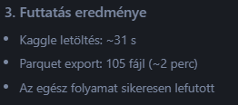
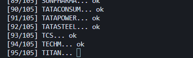
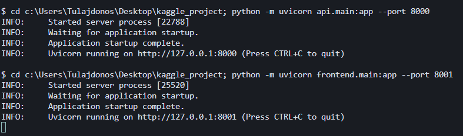
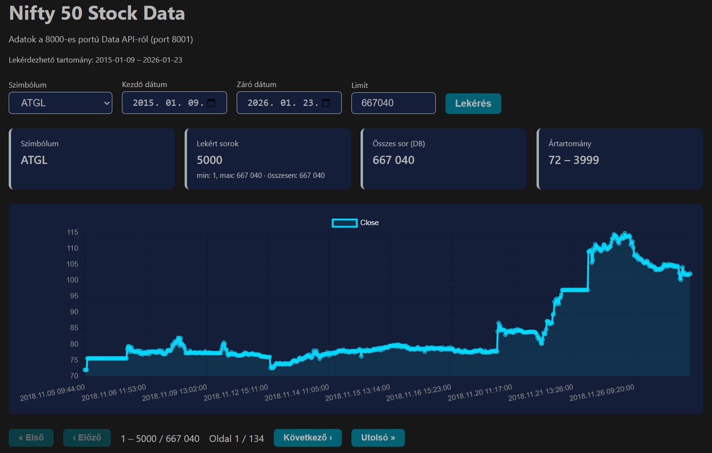
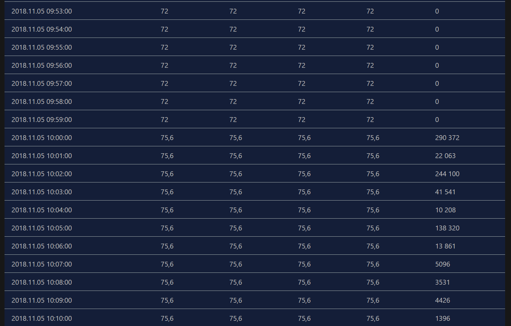
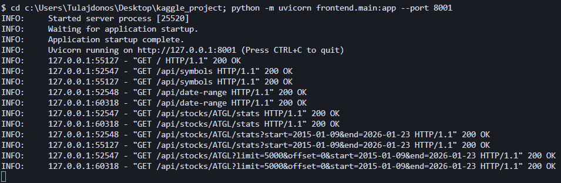

# Nifty 50 Stock Market Data – Kaggle → Parquet

Részvényadatok letöltése a Kaggle-ról és átalakítása Parquet formátumba a gyors lekérdezéshez.

## Első indulás (sorrendben)

1. **ETL folyamat** – először futtasd (letöltés + Parquet export):
   ```bash
   python -m etl.run_etl
   ```

2. **API-k indítása** – utána, két terminálban:
   ```bash
   python -m uvicorn api.main:app --port 8000    # Data API
   python -m uvicorn frontend.main:app --port 8001   # Frontend
   ```
   → Böngészőben: http://localhost:8001



## Dataset

**Source:** [Stock Market Data - Nifty 50 Stocks (1 min data)](https://www.kaggle.com/datasets/debashis74017/stock-market-data-nifty-50-stocks-1-min-data)  
**Content:** OHLCV (Open, High, Low, Close, Volume) 1 perces adatok  
**Méret:** ~1 GB CSV, ~99 millió sor, 105 szimbólum (részvények + indexek)

---

## Előfeltételek

### 1. Kaggle API token

1. Jelentkezz be a [Kaggle](https://www.kaggle.com)-re
2. Nyisd meg: **Account** → **Settings** → **API** → **Create New Token**
3. Letöltődik egy `kaggle.json` (vagy újabb: `access_token`)

### 2. Token elhelyezése

**A) access_token fájl (ajánlott):**

```
Windows:  C:\Users\<felhasználó>\.kaggle\access_token
Linux/macOS:  ~/.kaggle/access_token
```

A fájl tartalma: a token egyetlen sorban (pl. `KGAT_xxxxx...`).

**B) Környezeti változó:**
```powershell
$env:KAGGLE_API_TOKEN = "KGAT_your_token_here"
```

### 3. Python csomagok

```bash
pip install kagglehub pandas pyarrow
```

---

## Lépések

### Egyszeri indítás (ajánlott)

```bash
python -m etl.run_etl
```

- Letölti az adatokat a Kaggle-ról (ha még nincs cache-ben)
- Parquet formátumba exportál (symbol particionálással)
- Időtartam: ~30 s letöltés (cache) + ~2 perc export

**Tisztítás után újraindításhoz:**
```bash
python -m etl.run_etl --clean
```
Törli a `data/parquet`-ot és a Kaggle CSV cache-t, majd nulláról letölt és exportál.

### Külön lépések (opcionális)

```bash
python etl/download_dataset.py   # Csak letöltés
python etl/export_to_parquet.py  # Csak Parquet export
```

---

## Kimenet struktúra

Parquet konvertálás (pár másodperc):



```
data/parquet/
├── symbol=ABB/
│   └── data.parquet
├── symbol=RELIANCE/
│   └── data.parquet
├── symbol=TCS/
│   └── data.parquet
└── ... (105 mappa)
```

**Parquet schema:**
| Oszlop | Típus |
|--------|-------|
| date | timestamp |
| open | float |
| high | float |
| low | float |
| close | float |
| volume | int64 |
| symbol | string |

---

## Adatbetöltés (opcionális)

A CSV adatok betöltéséhez: `python etl/load_data_pyspark.py` (Java szükséges)

---

## DuckDB szerepe

Az API a **DuckDB**-t használja a Parquet fájlok lekérdezéséhez:

- **Közvetlen Parquet olvasás** – nincs adatbázis szerver, a `read_parquet()` a lemezről olvassa a fájlokat
- **SQL lekérdezés** – `SELECT`, `WHERE`, `ORDER BY`, `LIMIT` stb. a Parquet adatokon
- **In-memory** – minden futás memóriában történik (`:memory:`)
- **Lazy olvasás** – csak a kért oszlopokat és sorokat dolgozza fel, nem tölt mindent be

Tehát a DuckDB egy analitikai motor, amely Parquet fájlokon fut – nem kell külön adatbázis telepítése vagy migráció.

---

## Használat a Parquet után

API-k indítása:



### Data API (port 8000)
```bash
python -m uvicorn api.main:app --port 8000
```

### Frontend (port 8001)
Lekérdezi a 8000-es API-t és megjeleníti az adatokat (grafikon, táblázat):
```bash
python -m uvicorn frontend.main:app --port 8001
```
→ http://localhost:8001



Táblázat lapozással (szerveroldali pagination):



CLI log példa:



**Architektúra:** Böngésző ← Frontend (8001) ← Data API (8000) ← Parquet

### Egyéb
- **DuckDB:** `read_parquet('data/parquet/**/*.parquet')`
- **PySpark:** `spark.read.parquet('data/parquet')`

Lásd az `api/README.md` és a `frontend/README.md` fájlokat.
